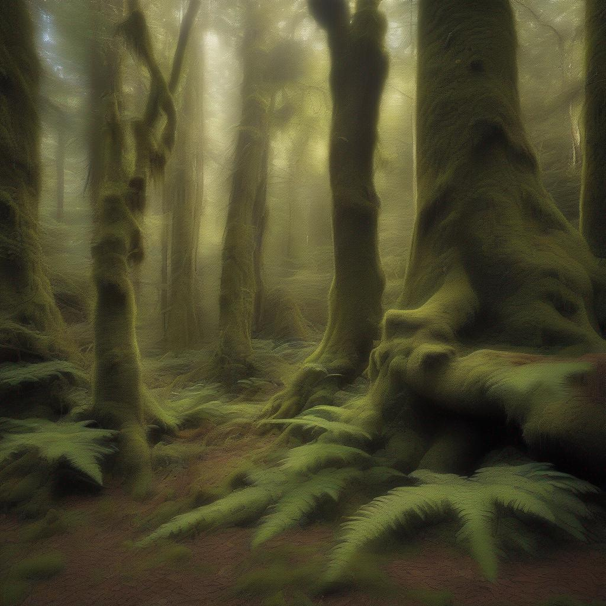
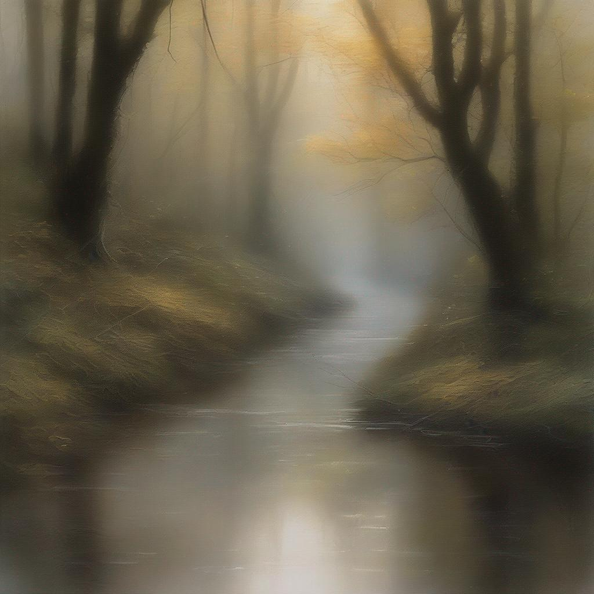
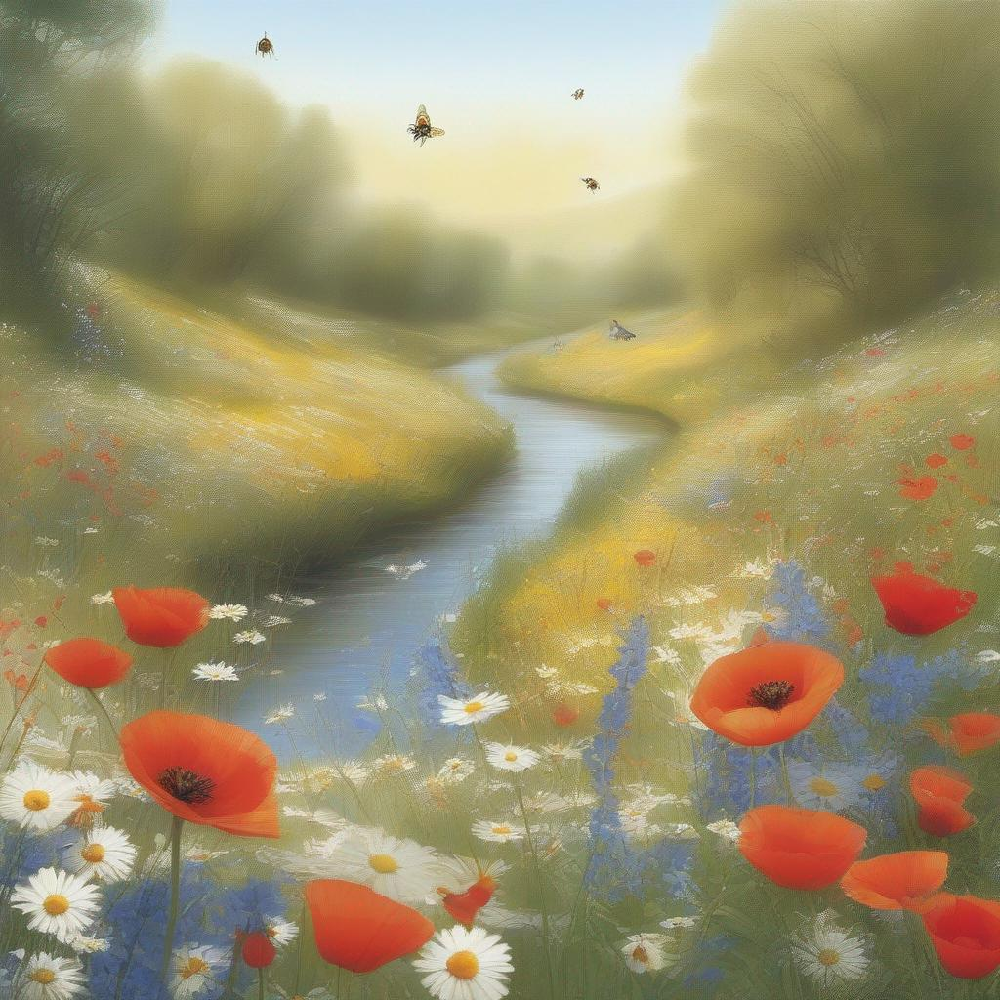
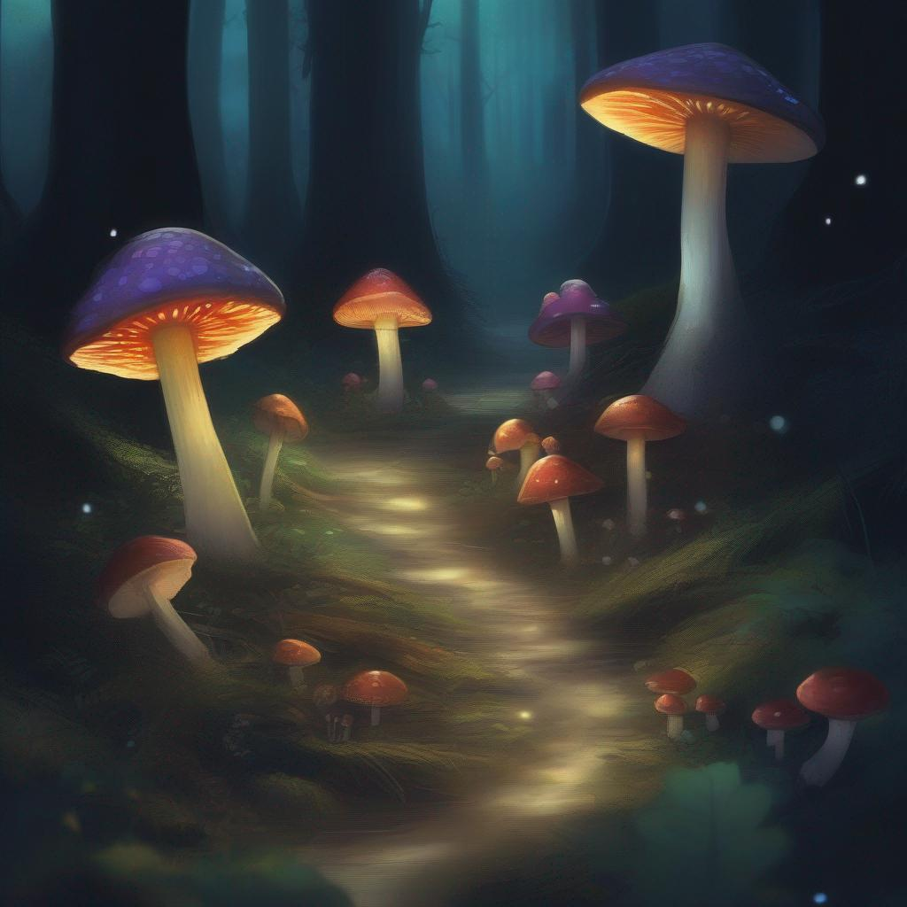
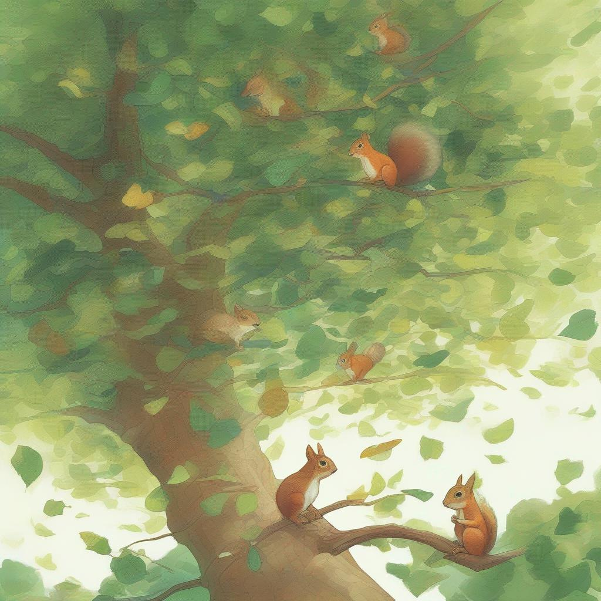
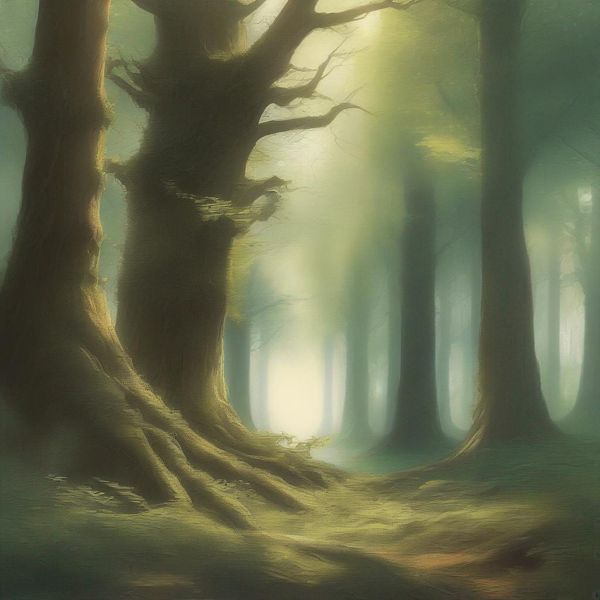
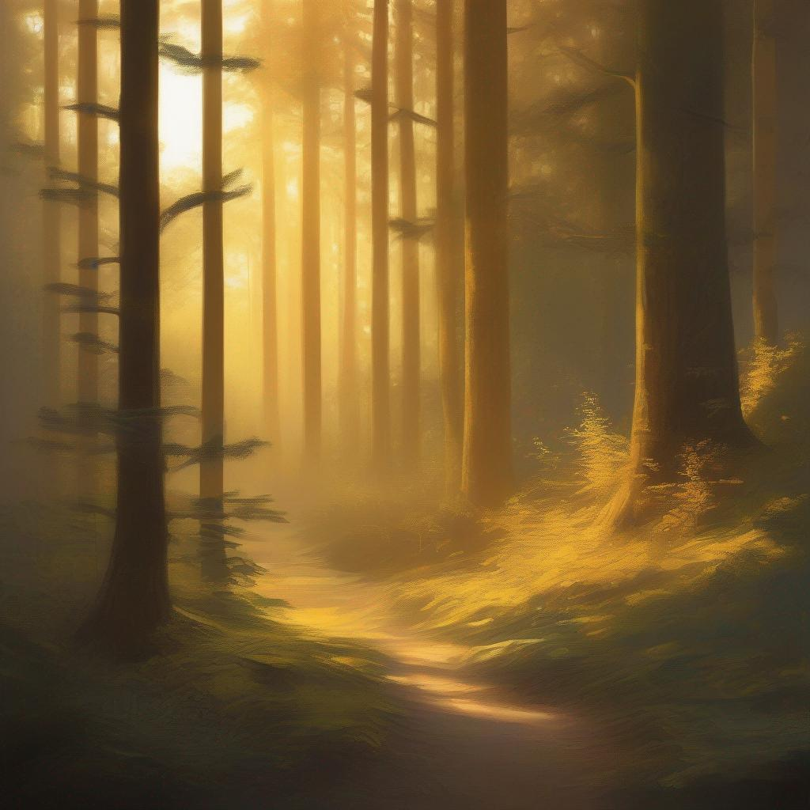

In the heart of the ancient forest, the trees stretched towards the sky like venerable sentinels. Their trunks, thick with age, were adorned with mosses and lichen, giving them an almost mystical appearance. Sunlight filtered through the dense canopy, casting dappled patterns of light and shadow on the forest floor, which was carpeted with fallen leaves and delicate ferns.
In the stillness of the early morning, a gentle breeze whispered through the branches, causing the leaves to rustle softly. This quiet symphony was accompanied by the occasional call of a distant bird, its melody echoing through the trees. Closer to the ground, a stream wove its way through the undergrowth, its waters clear and cold as they bubbled over smooth stones and twisted roots.
The stream's banks were lined with a riot of wildflowers, their petals glistening with dew. Vivid bluebells mingled with bright red poppies, and delicate white daisies nodded in the gentle breeze. Bees buzzed lazily from blossom to blossom, collecting nectar in the golden morning light.
In the deeper shadows, mushrooms of various shapes and sizes thrived, their caps creating tiny umbrellas that dotted the forest floor. Some glowed faintly in the dim light, a bioluminescent promise of magic in the air.
Above, the canopy was a mosaic of greens, the leaves shimmering like emeralds in the sunlight. Birds flitted from branch to branch, their feathers a blur of color as they sang their morning songs. Among the higher branches, squirrels chased each other, their playful antics shaking the leaves and sending a cascade of tiny twigs to the ground below.
The forest was alive with the quiet, steady pulse of life. Every leaf, every drop of water, every ray of sunlight played its part in the grand symphony of nature. The trees, ancient and wise, stood as silent witnesses to the ceaseless dance of the seasons, their roots deep in the earth and their branches reaching for the heavens.
As the sun climbed higher in the sky, the light grew warmer and the shadows shorter. The forest, bathed in this golden light, seemed to glow with an inner radiance. It was a place of serene beauty, where time moved with the slow grace of growing things and the heart of nature beat in gentle harmony.